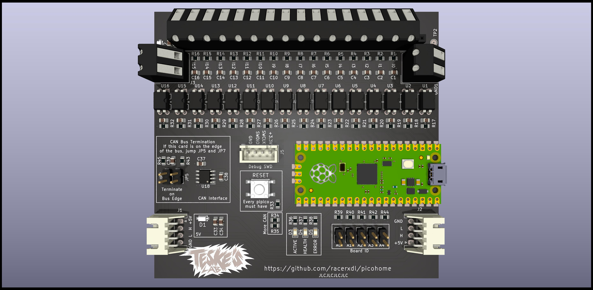

# pico-input

This board is part of picohome project. It features:

* CAN Bus - Fully controlled through CAN
* 5 bit address - Up to 32 boards in the same CAN bus
* 16 opto-coupled inputs which works from 12V to 24V supply directly to momentary touch switches

