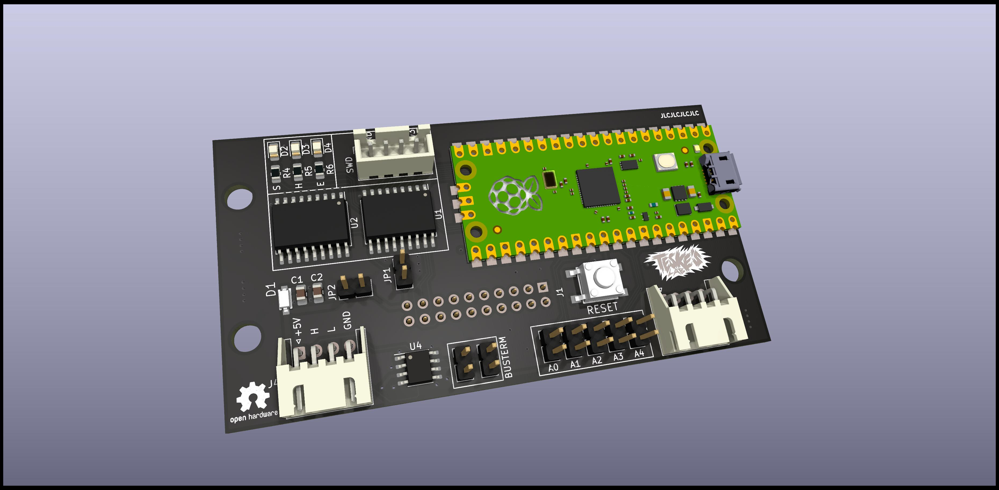

# pico-relay

This board is part of picohome project. It features:

* CAN Bus - Fully controlled through CAN
* 5 bit address - Up to 32 boards in the same CAN bus
* 16 open-collector 200mA outputs that can switch relays up to 24V
* Design to fit over a chinese 16 relay board

